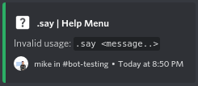

#  Ivy


Ivy is a TypeScript library that deals with the fundamentals of building a Discord.js-based bot.

## Table of Contents
- [Installation](#installation)
- [Example Usage](#example-usage)
- [Ivy Engine Preferences](#ivy-engine-preferences)
- [Per-Guild Data](#per-guild-data)
- [Commands](#commands)
	- [Constructor Parameters](#constructor-parameters)
	- [Command Permissions](#command-permissions)
	- [Command Example](#command-permissions)
- [Pagination](#blockquote)
    - [Auto page generation](#auto-page-generation)
    - [Manually defining pages](#manually-defining-pages)
- [Guild Queues](#guild-queues)
- [Contributing](#contributing)
- [License](#license)

## Installation

Use npm to install Ivy.

```bash
npm install @ilefa/ivy
```

Since Ivy is currently hosted on GitHub packages, you will need to make a ``.npmrc`` file in the root of your project, and insert the following:

```env
@ilefa:registry=https://npm.pkg.github.com
```

## Example Usage

```ts
import {
    Client,
    Guild
} from 'discord.js';

import {
    Colors,
    GuildDataProvider,
    GuildTokenLike,
    IvyEngine,
    Logger,
    StartupRunnable,
    time
} from '@ilefa/ivy';

export default class StonksBot extends IvyEngine {

    constructor() {
        // Sample configuration for StonksBot
        super({
            token: process.ENV.TOKEN,
            name: 'Stonks',
            logger: new Logger(),
            gitRepo: 'ilefa/stonks',
            superPerms: [
                'xxxxxxxxxxxxxx'
            ],
            reportErrors: [
                'xxxxxxxxxxxxxx'
            ],
            color: 0xFF9800,
            provider: new DataProvider(),
            startup: new StartupHandler(),
            presence: {
                status: 'ONLINE',
                activity: {
                    type: 'COMPETING',
                    name: 'in buying high, selling low.'
                }
            },
            discord: {
                partials: ['MESSAGE', 'CHANNEL', 'REACTION']
            }
        });
    }

    // Called when everything is up and running
    onReady = (client: Client) => {
        // If you have a custom event handler, register it here using IvyEngine#registerEventHandler()
        this.registerEventHandler(new CustomEventHandler(this, ...));
    }

    // Register all of your commands in one place
    registerCommands() {}

    // Likewise, with modules, you can register them all here
    registerModules() {}

    // If you have any test flows, you can register them here
    registerFlows() {}

}

class DataProvider implements GuildDataProvider<CustomGuildToken> {
    
    async load(guild: Guild): Promise<CustomGuildToken> {
        // load from SQL, or wherever else
        return {
            prefix: '.',
            games: {
                category: 'xxxxxxxxxxxxxx',
                feed: 'xxxxxxxxxxxxxx',
                max: 5
            }
        }
    }
    
    async save(guild: Guild, data: CustomGuildToken): Promise<void> {
        // save to SQL, or wherever else
    }

}

// Define any per-server preferences here, such as feed channels, or restricted roles, or whatever you'd like
type CustomGuildToken = GuildTokenLike & {
    games: {
        category: string;
        feed: string;
        max: number;
    }
}

// Will be executed upon startup - maybe add some flashly watermark or something cool!
class StartupHandler implements StartupRunnable {
    run = ({ logger }: IvyEngine) => {
        logger.unlisted(`Booting ${logger.wrap(Colors.GREEN, 'Stonks')} version ${logger.wrap(Colors.DIM, '0.1 (master)')}`);
        logger.unlisted(`ILEFA Labs (c) ${time(Date.now(), 'YYYY')}`);
        logger.unlisted(``);
    }
}

// Instantiate the IvyEngine inherited class, and Ivy will take care of the rest!
new StonksBot();
```

## Ivy Engine Preferences
*Any parameters denoted with a "?" are optional*

| Parameter            |  Type                    |  What is it                                                                         |
| -----------          |  -----------             | -----------                                                                         |
| ``token``            | ``string``               | your bot token from the discord developer portal                                    |
| ``name``             | ``string``               | the name of your bot, so it can be referred to in logs, and other internal settings |
| ``logger``           | ``Logger``               | an ivy logger instance, with customizations if desired                              |
| ``gitRepo?``         | ``string``               | if you would like version tracking (the ability for the bot to know it's current git version/branch), you can enter it's repo name in the following format: ``name/repo``, such as ``ilefa/ivy`` |
| ``superPerms``       | ``string[]``             | an array of discord snowflake ids corresponding to users that will have full privileges for the bot, regardless of set permissions in commands |
| ``reportErrors``     | ``string[]``             | an array of discord snowflake ids corresponding to servers in which the bot will display verbose information on command errors |
| ``color``            | ``string``               | a color code, either a hex number, or hex string that will be respected by embeds and other elements created by ivy utilities |
| ``prefix?``          | ``string``               | prefix option for commands in case a provider is not specified (only utilized if ``provider`` is not supplied) |
| ``provider?``        | [GuildDataProvider<T>](src/lib/data/provider.ts) | optional instance of an ivy guild data provider, which will allow ivy to save and load per-guild data of your choosing for internal systems |
| ``commandMessages?`` | [IvyCommandMessages](src/lib/data/engine.ts#L47) | messages for various errors (permissions, internal, etc.) for the bot to display |
| ``startup?``         | [StartupRunnable](src/lib/startup.ts)            | an instance of a runnable that will be called upon startup; feel free to place watermarks or other cool things the bot will display or do on startup |
| ``presence``         | [PresenceData](https://discord.js.org/#/docs/main/stable/typedef/PresenceData)   | presence (status) information for the bot to respect                          |
| ``discord``          | [ClientOptions](https://discord.js.org/#/docs/main/stable/typedef/ClientOptions) | custom discord api client options, such as sharding, privileged intents, etc. |  

## Per-Guild Data

### Preface
If you do not require per-guild data, do not supply an instance of an ``GuildDataProvider`` while setting up your Ivy Engine Preferences, and instead supply a ``prefix`` parameter and the [DefaultGuildDataProvider](src/lib/data/default.ts) will be initialized with said prefix for you.

Depending on what kind of project you are using this framework for, it may be required to store per-guild information such as prefixes, or some special channel IDs.

The GuildDataProvider API will give you a clean and structured way to handle this data. All you need to do is supply an instance of ``GuildDataProvider<P>``,
and define a type that will specify what the data per-guild will look like.

Let's suppose that a guild has to store information as to where certain logs should be sent - that would look something like this:

```ts
import { GuildDataProvider } from '@ilefa/ivy';

export type CustomGuildToken = GuildTokenLike & {
    logChannel: string; // let's store the channel ID as a string
    feedChannel: string; // and here, let's store another fictious channel's ID as a string
}

export default class DataProvider extends GuildDataProvider<CustomGuildToken> {

    async load(guild: Guild): Promise<CustomGuildToken> {
        // implement some logic of grabbing the token from a database of any sort
        let data = ...;

        return {
            prefix: data.prefix,
            logChannel: data.logChannel,
            feedChannel: data.feedChannel
        }
    }
    
    async save(guild: Guild, data: CustomGuildToken): Promise<void> {
        // implement some logic of saving the token to your database
    }

}

```

Additionally, you can use the included ``CachedGuildDataProvider`` to cache the results of guild tokens if you have a Redis database handy.
The implementation of the cached provider is quite similar to the default provider:

```ts
import { CachedGuildDataProvider } from '@ilefa/ivy';

// We will be utilizing the same CustomGuildToken as the previous example - so that's where this type comes from.
export default class DataProvider extends CachedGuildDataProvider<CustomGuildToken> {

    constructor() {
        super({
            redis: {
                host: '127.0.0.1'
            }
        })
    }

    // Once load() is called, it will call fetch() in case the data is not available in the cache.
    async fetch(guild: Guild): Promise<CustomGuildToken> {
        // implement some logic of grabbing the token from a database of any sort
        let data = ...;

        return {
            // prefixes are required by GuildTokenLike, so if you want one constant prefix, just supply an unchanging string
            prefix: data.prefix,
            logChannel: data.logChannel,
            feedChannel: data.feedChannel
        }
    }

    /**
     * Once this method is called, the cache will also be updated with the new data
     * You don't need to try to update the cache from within here.
     */
    async update(guild: Guild, data: CustomGuildToken): Promise<void> {
        // implement some logic of saving the token to your database
    }

}
```

## Commands
Ivy includes a command system which makes creating advanced commands pretty simple.

### Constructor Parameters
| Parameter            | Type          | What is it                                                                                         |
| -----------          | -----------   | -----------                                                                                        |
| ``name``             | ``string``    | the string used to execute your command                                                            |
| ``help``             | ``string``    | the help message of the command                                                                    |
| ``helpTitle``        | ``string``    | the title of the help embed (supply ``null`` for the default)                                      |
| ``helpFields``       | ``string``    | the fields to display in the help embed (supply ``[]`` for none)                                   |
| ``permission``       | ``number``    | the base permission required to execute the command *(see below)*                                  |
| ``deleteMessage?``   | ``boolean``   | whether or not to delete the original message sent by the user                                     |
| ``hideFromHelp?``    | ``boolean``   | whether or not to hide this command from the help menu *(see below)*                               |
| ``permitRoles?``     | ``string[]``  | role names or ids that can execute this command regardless of their permissions                    |
| ``permitUsers?``     | ``string[]``  | user ids that can execute this command regardless of their permissions                             |
| ``internalCommand?`` | ``boolean``   | whether or not this command can only be executed in servers included in the ``reportErrors`` array |

### Command Permissions
There are several ways to ensure that only people you want to be able to execute certain commands can.

#### Base Permission
The base permission parameter, simply named ``permission`` in the Command constructor will only allow users with that permission, or above to execute a given command.
This permission can be specified either by using the Discord.js [Permissions.FLAGS](https://https://discord.js.org/#/docs/main/stable/class/Permissions?scrollTo=s-FLAGS) object, or by manually specifying the Bitfield values for the permissions you want (but we think you'll probably be using the former method).

We have also included a special permission, under the ``CustomPermissions`` interface, which will only allow users specified in the ``superPerms`` array to use the given command.
This special permission is aptly named ``CustomPermissions.SUPER_PERMS``. 

#### Role Overrides
In addition to the base permission, you can also specify certain roles that will have access to the command regardless of their server or global permissions.

This can be easily accomplished by specifying an array of either role names, or role IDs under the ``permitRoles`` parameter in the Command constructor.

#### User Overrides
In addition to the two previous methods of controlling command access, you can also individually grant users permissions to your commands.

This can be done by specifying an array of user IDs to the ``permitUsers`` parameter in the Command constructor.

### Command Example
Below is a simple example of the command system in action.

```ts
import { Command, CustomPermissions, emboss } from '@ilefa/ivy';

export class SayCommand extends Command {

    constructor() {
        super('say', `Invalid usage: ${emboss('.say <message..>')}`, null, [], CustomPermissions.SUPER_PERMS, true, true, ['Admin'], [], true);
    }

    async execute(user: User, message: Message, args: string[]): Promise<CommandReturn> {
        // Hmm, the user didn't provide any arguments - give them the help menu.
        if (args.length === 0)
            return CommandReturn.HELP_MENU;

        // Grab whatever the user provided as arguments, and then echo it back into the channel.
        let content = args.join(' ');
        message.channel.send(content);
        return CommandReturn.EXIT;
    }

}

// Then, inside your class that extends IvyEngine, inside the registerCommands() function, add the following line:
registerCommands() {
    // ...
    this.registerCommand(new SayCommand());
}
```

In the above example, a simple say command is created, which simply echoes back anything the user provides as arguments into the channel they sent it in.

Notice the parameters passed to the constructor - the first is what the bot should listen for, in this case "say", so when .say (or whatever prefix you choose) is messaged,
the execute function will be called with the user who sent the message, the message object itself, and the arguments provided. The next three arguments have to do with the help
message that will be displayed if ``CommandReturn.HELP_MENU`` is returned inside of the execute function (or if ``-h`` is supplied as the first and only parameter).

The first of these is the message itself that will be displayed, the second is a custom title for the embed, which is not provided, and the third is an array of fields, which is also not provided.
Below is what results from these three parameters being set in this way,



The next parameter is the base permissions, and in this case, you must have Super Permissions in order to execute the command. Moving onward, the next parameter ``deleteMessage`` will tell the command manager whether or not to delete the user's command message before executing the command itself, so in this case it would delete the ``.say [...]`` message the user had sent, and then echo back the input to the channel.

The next parameter is one we provided in case you want to hide certain commands from your help command implementation, so let's say you have some funny commands or debugging commands you don't want to show up in a public help message, you can use this parameter to filter those out.

Two of the remaining three parameters, ``permitRoles`` and ``permitUsers``, are explained above in the [Role Overrides](#role-overrides) and [User Overrides](#user-overrides) sections respectively.

Lastly, the ``internalCommand`` parameter will only allow this command to be run in servers specified in the ``reportErrors`` array, and is helpful if you have development commands that you only want to be ran in certain development servers.

## Pagination
Ivy comes with a powerful built-in pagination utility, which allows you to created paginated embeds.
This allows rich data to be displayed across multiple pages of embeds, and has a very intuitive implementation.

### Automatic page generation
If you have an array of objects, and wish to paginate them this is probably the way to go for you.
Below is a simple example of how to achieve this:

```ts
import { link, PageContent, PaginatedEmbed } from '@ilefa/ivy';

let items: T[] = ...;

// You will want to create a transform method which will convert a list of items into a page:
const transform = (items: T[]) => PageContent {

    // Items will be a list of items that will displayed on the page,
    // so for example, if you have a list of songs, and want to display
    // them on different embed pages, you would do something like this:
    return {
        description: '',
        fields: [
            items.map(song => {
                return {
                    name: `${song.name} (${song.duration})`,
                    value: `${link('Link', song.link)} - Created by ${song.author}`,
                    inline: false
                }
            })
        ]
    }

    // What this does, is on each page, it would display fields
    // containing N songs on said page with their name, duration, and author. 
}

PaginatedEmbed.ofItems<T>(
    engine, author, 'Title',
    'www.example.com/icon.png',
    items, 10, transform
);
```

### Manually defining pages
The process is almost the same for manually defining pages with the paginator, but instead of
passing in an array of items, how many items should be per-page, and a transformer function,
you would do something along these lines:

```ts
import { PaginatedEmbed } from '@ilefa/ivy';

let pages: PageContent[] = ...;

PaginatedEmbed.of(
    engine, author, 'Title',
    'www.example.com/icon.png',
    pages
);
```

Please note that you are fully in control of what is on the pages, and will need to deal with
how many items are per-page, how they are rendered, and everything like that. However, if you
are simply making static pages, and don't need to automated approach, this will work far better
for you.

## Guild Queues

Ivy includes a built-in GuildQueue utility, that allows for an easy way to maintain managed queues for guilds.
This system is quite useful in situations where various queues need to be kept track of between guilds, such as for song queues between guilds.

It is quite easy to setup and use a GuildQueue:

```ts
import { GuildQueue } from '@ilefa/ivy';

// Keeps track of items of type T.
const queue = new GuildQueue<T>;

// Retrieves the queue for the specified guild.
const item = queue.get(guild);

// Manually sets the queue for the specified guild to the second parameter
queue.set(guild, ...T[]);

// Applies a function to the entire queue, and returns the modified queue
// (the second parameter, `destructive` determines whether or not the actual queue is modified)
const mapped = queue.map(guild, false, t => ...);

// Shuffles the queue, and once again, the second parameter, `destructive` determines whether or not the actual queue is modified.
const shuffled = queue.shuffle(guild, false);

// Sorts the queue by a given sorting function, and you guessed it, the second parameter is whether or not the actual queue is modified.
const sorted = queue.sort(guild, false, (a, b) => ...);

// Returns the length of a specified guild queue.
const len = queue.length(guild);

// Returns whether or not a queue exists for the specified guild.
const has = queue.has(guild);

// Returns whether or not the guild queue contains some items that match the specified predicate.
const some = queue.some(guild, predicate => ...);

// Returns whether or not every item in the guild queue matches the specified predicate.
const every = queue.every(guild, predicate => ...);

// Returns whether or not no items in the guild queue match the specified predicate.
const none = queue.none(guild, predicate => ...);

// Reduces all items in the guild queue by a specified reducer.
const reduced = queue.reduce(guild, reducer => ...);

// Filters out items that match a given predicate in the guild queue.
const filtered = queue.filter(guild, predicate => ...);

// Pushes an item, T, to the end of the queue for a specified guild.
queue.push(guild, T);

// Pops the first item off of the queue for the specified guild, and returns it.
const first = queue.pop(guild);

// Returns the first item off of the queue for the specified guild without removing it.
const first = queue.peek(guild);

// Clears the queue for a specified guild.
queue.clear(guild);

// Clears all values from the global queue.
queue.flush();
```

## Contributing
Pull requests are welcome. For major changes, please open an issue first to discuss what you would like to change.

Please make sure to update tests as appropriate.

## License
[GPL-3.0](https://choosealicense.com/licenses/gpl-3.0/)